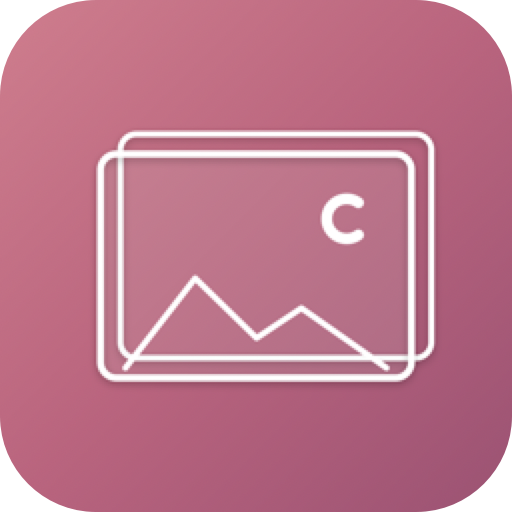

<p align="center">
  
</p>

# deree

**D**oes **E**very **R**obot-**E**xcluded **E**dit

A clipboard image history for the work AI leaves behind. Your AI agent can write the code and take the screenshots, but someone still has to paste them into the PR. That someone is you. deree keeps your clipboard images ready so the last mile hurts a little less.

## Features

- Clipboard image history displayed in a floating side panel on the right edge of the screen
- Automatically captures images from screenshots, app copies, and Finder file copies (Cmd+C)
- Click a thumbnail to copy it back to the clipboard
- Keeps the last 50 images, older ones are automatically cleaned up
- Panel slides in/out from the right edge with animation
- Click the menu bar icon to toggle the panel instantly
- Panel auto-hides when you switch to another app
- Persists history across app restarts
- Runs as a menu bar app (no Dock icon)

## Requirements

- macOS 14.0 (Sonoma) or later
- Xcode 26.0 or later (Swift 6)
- [Mint](https://github.com/yonaskolb/Mint) (CLI tool manager)

## Install

```bash
# Install Mint (manages XcodeGen and other CLI tools)
brew install mint

# Clone and enter the repo
git clone https://github.com/chigichan24/deree.git && cd deree

# Install CLI dependencies (XcodeGen, pinned in Mintfile)
mint bootstrap

# Generate Xcode project from project.yml
mint run xcodegen generate

# Build a Release binary
xcodebuild -project deree.xcodeproj -scheme deree -configuration Release \
  -destination 'platform=macOS' -skipMacroValidation \
  -derivedDataPath build

# Copy to Applications and launch
cp -r build/Build/Products/Release/deree.app /Applications/
open /Applications/deree.app
```

To launch at login, add deree in System Settings → General → Login Items.

## Development

```bash
# Generate Xcode project (re-run after editing project.yml)
mint run xcodegen generate

# Build (debug)
xcodebuild -project deree.xcodeproj -scheme deree \
  -destination 'platform=macOS' -skipMacroValidation build

# Run tests
xcodebuild -project deree.xcodeproj -scheme dereeTests \
  -destination 'platform=macOS' -skipMacroValidation test
```

Or open `deree.xcodeproj` in Xcode after running `mint run xcodegen generate`.

> **Note:** `-skipMacroValidation` is required because TCA uses Swift macros from SPM packages.

All warnings are treated as errors (`SWIFT_TREAT_WARNINGS_AS_ERRORS`, `GCC_TREAT_WARNINGS_AS_ERRORS`).

## Usage

1. Launch the app -- an icon appears in the menu bar (may be hidden behind the notch on MacBooks)
2. Copy any image (screenshot, browser, Figma, Finder Cmd+C on image files, etc.)
3. Left-click the menu bar icon to slide in the panel
4. Click a thumbnail to copy it back to the clipboard
5. Left-click the icon again, or switch to another app, to slide the panel away
6. Right-click the menu bar icon to quit

## Data Storage

Images are stored in `~/Library/Application Support/deree/`. To reset all data, quit the app and delete that directory.

## Docs

- [Architecture](docs/architecture.md) -- TCA feature composition, data flow, concurrency model
